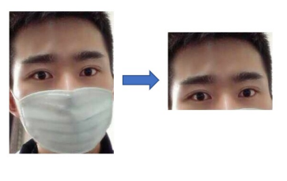
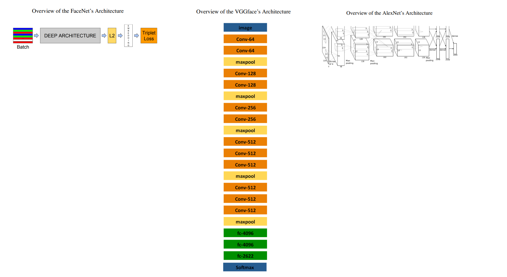
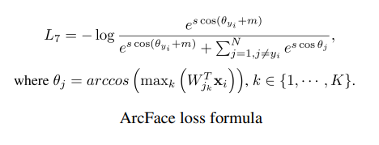
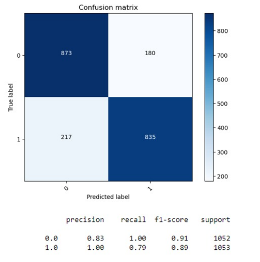

# Overview

This is the overview of "Masked Face Recognition with deep learning", a self-proposed project for the course COMP4471 of The Hong Kong University of Science and Technology in 2022-2023.

## Abstract

Wearing masks has become the new normal during the Covid-19 pandemic. However, this also makes facial recognition, a widely used biometrics authentication, very difficult with important features like mouth and nose hidden. In this project, we want to propose a method to conduct masked face recognition. The first step is to remove the face region occluded by the mask. Next, we will apply three pre-trained Convolutional Neural Networks (CNN), which are FaceNet, VGGFace, and AlexNet for face embedding with ArcFace as a loss function. The embedding will passed into two classifiers, namely the K-nearest-neighbors classifier (KNN), and the Multilayer Perceptron classifier (MLP). We will experiment using the Real World Masked Face Dataset and evaluate their performance. Our project successfully implements a face recognition model with 80.33% accuracy.

## Methodology

### 5.1 Occlusion removal approach

We attempted an occlusion removal approach as it seems to achieve more reliable results in our literature review, compared with the restoration approach which relies on unpredictable restored images for face recognition. The details of the occlusion removal are explained in report.pdf. However, we discovered that such a simple removal method may not be that reliable and we also compare the results for a model without discarding the lower half.

### 5.2 Face embedding

The pre-processed images are fed into DCNN for face embedding. To allow more efficient training, we used transfer learning. We have selected the following pre-trained models that are well-trained for non-masked face recognition for experimentation.

- FaceNet
- VGGface
- AlexNet

### 5.3 Loss function

In our progress report, we proposed to experiment with the triplet loss function and ArcFace function. However, given the proposed numbers of networks, loss function, and classifiers, we have to experiment 3 x 2 x 3 = 18 different networks and we might not have enough time for such implementation. With that in mind, We will only experiment
with ArcFace which is published more recently and can produce better results (99.53%) than triplet loss (98.98%) based on LFW. We therefore only use ArcFace for the computation of loss and for optimization during training.

### 5.4 Classification

The embedded vector will pass through a classification layer. In our progress report, we proposed to experiment with linear discriminant analysis (LDA), K-nearest neighbors classifier (KNN), and Multilayer Perceptron classifier (MLP) and see which model did the best job. Because of the time constraint, we only experiment with KNN and MLP which we are more familiar with.

## Experimentation and discussion

The best model is obtained with InceptionResNetV1, ArcFace, and MLP with 80.33% accuracy. We also have a failed attempt to remove other kinds of occlusions with face detection. Last but not least, we learned that our simple cropping method to remove occlusion may not be that helpful in increasing accuracy. A more sophisticated way that removes the mask but retains the non-masked region is necessary.

More details are discussed in report.pdf.

## Project Information

##### Topic Full Name

- Masked Face Recognition with deep learning

##### Group Members
- TSUI Ka Hei (https://github.com/khtsuiac)
- NG Chun Fung (https://github.com/cfngai)
